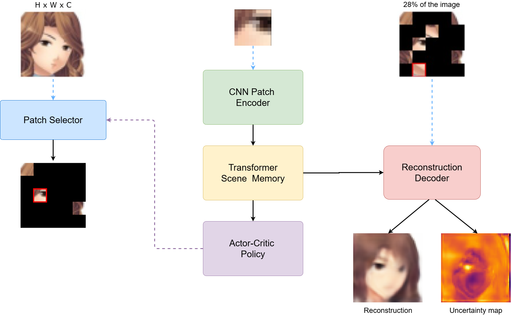
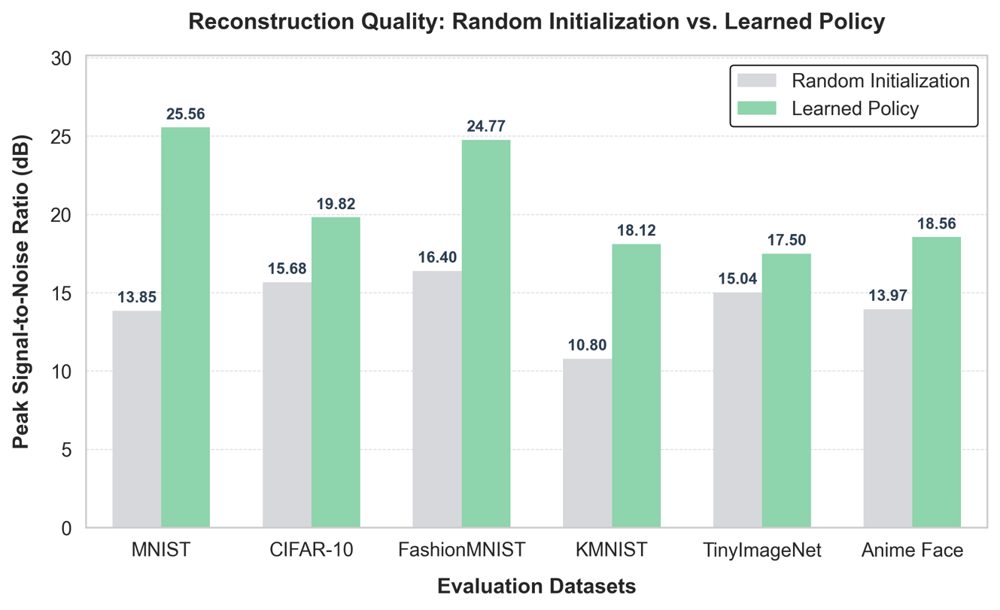
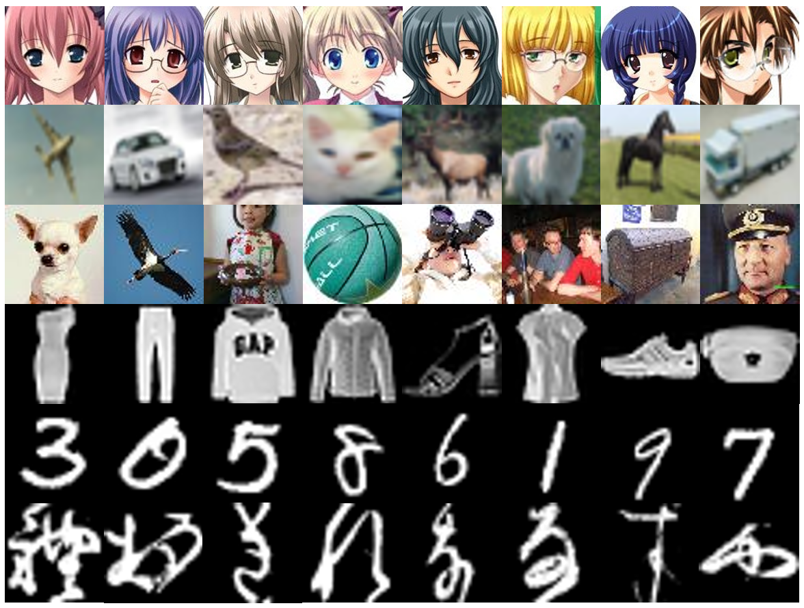
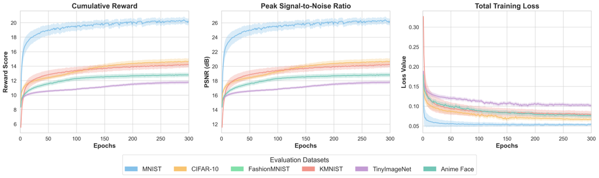
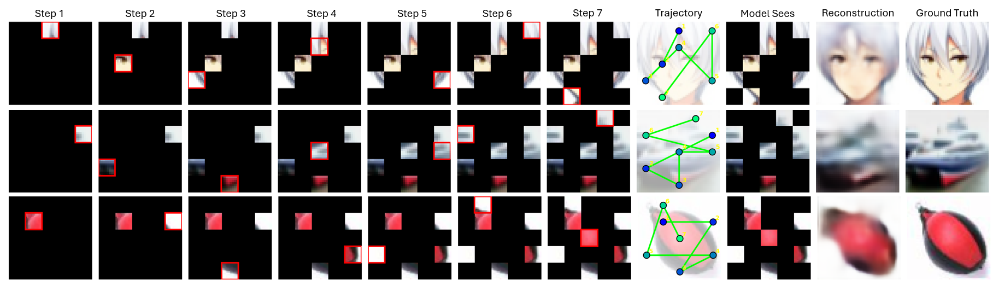

# ActiveGlimpse

### RL-guided sparse image reconstruction

ActiveGlimpse reconstructs images from a limited sequence of observed patches. A learned policy chooses where to look, while the reconstruction model uses those observations to recover the full image.

<p align="center">
	
</p>

## At A Glance

| Component | Release |
|---|---|
| Datasets | MNIST, Fashion-MNIST, KMNIST, CIFAR-10, Tiny ImageNet, AnimeFace |
| Observation budget | 7 patches on a 5 x 5 grid, approximately 28% visible |
| Main metric | Peak signal-to-noise ratio (PSNR, dB) |
| Reproducibility | Clean notebooks, fixed seed, dataset configs, and paper figures |
| License | MIT |

## Headline Results

The learned policy improves reconstruction quality over random initialization on every reported dataset.

| Dataset | Random initialization | Learned policy | Improvement |
|---|---:|---:|---:|
| MNIST | 13.85 | **25.56** | +11.71 |
| CIFAR-10 | 15.68 | **19.82** | +4.14 |
| Fashion-MNIST | 16.40 | **24.77** | +8.37 |
| KMNIST | 10.80 | **18.12** | +7.32 |
| Tiny ImageNet | 15.04 | **17.50** | +2.46 |
| AnimeFace | 13.97 | **18.56** | +4.59 |

<p align="center">
	
</p>

<p align="center"><em>PSNR comparison. The original high-resolution figure is retained for paper use; the README display is intentionally constrained.</em></p>

## Repository Contents

## Repository layout

```text
.
├── README.md
├── LICENSE
├── requirements.txt
├── .gitignore
├── configs/                 # Reproducible experiment settings
├── src/                     # Small reusable utilities and public entry points
├── *.ipynb                  # Complete per-dataset experiment notebooks
├── results/figures/         # Paper figures copied from the experiment outputs
├── results/metrics.json     # Public numeric results, when released
├── checkpoints/             # Download instructions; weights are hosted externally
└── docs/                    # Reproduction and release notes
```

## Installation

Python 3.10 or newer is recommended. A CUDA-enabled PyTorch installation is recommended for training; CPU is sufficient for inspection and small smoke tests.

```bash
python -m venv .venv
# Windows: .venv\Scripts\activate
# macOS/Linux: source .venv/bin/activate
python -m pip install --upgrade pip
pip install -r requirements.txt
```

The standard datasets are downloaded by the relevant torchvision dataset loader. AnimeFace and Tiny ImageNet require the dataset archives and paths described in the corresponding notebook; these datasets are not redistributed here.

## Reproducing the experiments

Open the relevant notebook in VS Code or Jupyter and run it from top to bottom:

| Dataset | Notebook |
|---|---|
| MNIST | [MNIST.ipynb](MNIST.ipynb) |
| Fashion-MNIST | [FassionMNIST.ipynb](FassionMNIST.ipynb) |
| KMNIST | [KMNIST.ipynb](KMNIST.ipynb) |
| CIFAR-10 | [CIFAR.ipynb](CIFAR.ipynb) |
| Tiny ImageNet | [TinyImagenet.ipynb](TinyImagenet.ipynb) |
| AnimeFace | [animeface.ipynb](animeface.ipynb) |

The notebooks are output-free and can be opened directly in VS Code or Jupyter. Set the dataset root in the relevant notebook before running it. AnimeFace and Tiny ImageNet require external dataset downloads and are not redistributed here.

## Figures

<details>
<summary>Additional paper figures</summary>

<p align="center">
	
</p>

<p align="center">
	
</p>

<p align="center">
	
</p>

</details>

The source numbers for the table are stored in [results/metrics.json](results/metrics.json). Large checkpoints and raw pickle result dumps are excluded from Git; see [checkpoints/README.md](checkpoints/README.md) for the external release plan.

## License

The code is released under the MIT License. See [LICENSE](LICENSE) and [CITATION.cff](CITATION.cff).
